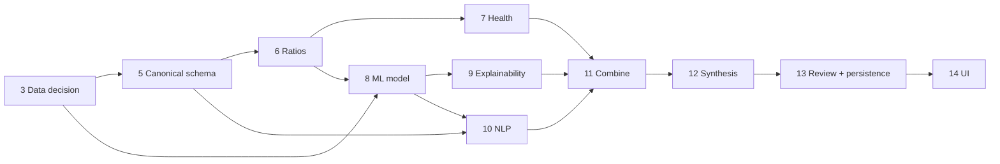

# Roadmap — AI Credit Risk Monitor Copilot

| | |
|---|---|
| **Status** | Phase 12 complete. Remaining work restructured from eight phases to four ([D-045](decision_log.md)); Phase 13 next |
| **Date** | 2026-09-19 |

Phases are completed one at a time. Each phase ends with tests/checks, a
status report and an explicit go-ahead before the next phase starts.

**Four phases remain — 13, 14, 17 and 19.** Phases 15, 16, 18 and 20 were
merged or cut in [D-045](decision_log.md); their rows are kept, and say so,
because every document here cross-references phases by number and renumbering
to tidy a table would invalidate the references that make the history
auditable.

## Phase status

| # | Phase | Status | Amendment ([D-009](decision_log.md)) |
|---|---|---|---|
| 1 | Problem definition & product design | ✅ Complete | Added data feasibility research and decision log |
| 2 | Engineering environment & repository | ✅ Complete | Confirmed Python 3.12 library compatibility ([engineering_setup.md](engineering_setup.md)); initial UI framework accepted ([D-012](decision_log.md)) |
| 3 | Data acquisition & understanding | ✅ Complete | Dataset decision gate resolved: Candidate B primary, audited at full scale — 178 usable positive events, ~7,973-company candidate negative universe ([D-013](decision_log.md), [data_dictionary.md](data_dictionary.md)). Point-in-time feature extraction and the actual negative-class sample are Phase 5/8 work |
| 4 | Document extraction | ✅ Complete | Golden set built: 12 filings, 342 XBRL reference values ([golden_set.md](golden_set.md)). **HTML path recovers 85% of reference values (100% on 2025–26 filings)** — first evidence the primary path works. HTML is primary and golden-set PDFs are generated, since SEC publishes no PDFs ([D-014](decision_log.md)); R-19 closed by measurement — the two PDF libraries tied 179/179, so pdfplumber is chosen on speed ([D-015](decision_log.md)). Also delivered: item-section detection for Phase 10 and upload validation for FR-04 ([extraction.md](extraction.md)). **Raised R-11 to High:** concept coverage is far thinner than assumed ([data_dictionary.md §6.1](data_dictionary.md)) |
| 5 | Financial statement parsing | ✅ Complete (audited) | Typed canonical schema with provenance ([canonical_schema.md](canonical_schema.md)): 26 concepts, per-concept XBRL tag policies and derivation rules ([D-016](decision_log.md), [D-018](decision_log.md)), annual-period and unit filtering, accounting-consistency validation, and bounded HTML corroboration ([D-017](decision_log.md)). **QM-01: 97.2% value/period accuracy** (247/254; the 7 misses are a ground-truth definition difference, 0 wrong values), 88.8% mean concept completeness, 12/12 independent balance-sheet checks. The audit found and fixed circular validation, liabilities overstated by noncontrolling interest, and debt understated by reading components as alternatives. Table-to-period alignment for FR-04 uploads deferred |
| 6 | Deterministic ratio engine | ✅ Complete (audited) | 13-ratio catalog across liquidity/leverage/profitability/coverage/cash-flow ([ratios.md](ratios.md)); 4-state result model ([D-019](decision_log.md)); ending-balance ROA/ROE ([D-020](decision_log.md)). M-2: 11/13 ratios reach 92-100% primary-period coverage on the golden set; full multi-year coverage falls to 48.2% on comparative years, a Phase 5 tag-completeness gap on older columns, not a Phase 6 defect ([ratios.md §6](ratios.md)) — **amended in Phase 8: most of that gap was the single-accession harness, not the data; the multi-filing path reaches 81.2% over 4× the period slots**. **Audit** found no formula/accounting/circularity errors; verified real-corpus invariants and the near-zero-denominator warning against distressed filers; added structured warnings and machine-readable missing/conflicting-concept accessors ([D-021](decision_log.md), [ratios.md §8](ratios.md)) |
| 7 | Financial health analysis | ✅ Complete (amended + re-validated in Phase 8) | Deterministic trend/signal engine on top of Phase 6 ratios ([financial_health.md](financial_health.md)): 5 dimensions (liquidity/leverage/profitability/coverage/cash_flow), 9-code signal catalog, no composite score ([D-022](decision_log.md)). Thresholds collected in `health/thresholds.py`, each disclosed and documented; industry-aware hooks explicitly deferred (§9 of the doc). M-3: 40.4% of ratio-trend slots on the 12-filing corpus reach a conclusive direction (rest `INSUFFICIENT_DATA`, expected — every filing's liquidity dimension is `INSUFFICIENT_DATA`, tracing to the same comparative-year coverage gap Phase 6's own M-2 measured); 37 signals fired, no false positive found on manual inspection of all 12 reports. Found and fixed a small pre-existing Phase 6 ordering bug (`ratios_for_filing` was not sorting periods chronologically) ahead of building on it ([D-023](decision_log.md)). **Phase 8 amendments:** an explicit analysis window ([D-024](decision_log.md)), and M-4 — the first real run of the multi-filing point-in-time path, which lifts conclusive trends 40.4% → 91.7% and removes every `INSUFFICIENT_DATA` dimension. The 37-signal false-positive claim was re-done over the resulting 153 signals: no fabrications, 3 endpoint artefacts in 90 trend-based signals, and one corrected **false negative** (Pfizer, 0 → 10 real signals) ([financial_health.md §7a](financial_health.md)) |
| 8 | Baseline ML model (logistic regression → **gradient boosting**, [D-034](decision_log.md)) | ✅ Complete | Reframed after inspecting the data: the target is a **365-day discrete-time bankruptcy hazard** over a company × filing panel, not a snapshot classification ([D-025](decision_log.md)). Delivered: the three audit prerequisites (Phase 7 analysis window [D-024](decision_log.md); M-4, the first real measurement of the multi-filing point-in-time path; CI); a 690-company corpus; a leakage-checked point-in-time dataset with three enforcement layers ([D-026](decision_log.md)); walk-forward out-of-time evaluation ([D-027](decision_log.md)); heuristic baselines, a six-family ablation and a gradient-boosting comparator ([D-028](decision_log.md)); and a reproducible artifact. Full results and limitations in [predictive_model.md](predictive_model.md). **Amended in Phase 10:** D-028's choice of the logistic model as primary was re-opened and reversed. Its two empirical grounds were tested for the first time — boosting's lead survives inside the event cohort (+0.054 [0.016, 0.091] paired, company-clustered) and survives with the `scale` features removed (+0.044 [0.008, 0.080]), and in that confound-free frame boosting's top drivers are leverage, profitability and liquidity while three of the *logistic* model's top seven are missingness indicators. **`gradient_boosting_all` is now the primary model** ([D-034](decision_log.md)) |
| 9 | ML evaluation & explainability | ✅ Complete | Reframed from "add SHAP" to "establish whether the predictive layer is trustworthy". Delivered: a model-agnostic explanation layer with structured caveats and a feature→ratio→fact→filing provenance chain ([D-029](decision_log.md), [D-031](decision_log.md)); attribution chosen per model family — **SHAP measured as unnecessary for the linear primary**, which it reconstructs exactly to 3.6e-15 ([D-030](decision_log.md)); and the point-in-time negative universe Phase 8 deferred ([D-032](decision_log.md)). **The findings are largely negative and that is the deliverable:** the same features predict every sampling-design property at least as well as bankruptcy (cohort 0.82/0.93, data-richness 0.95, industry 0.87/0.95 vs the label's 0.80/0.89); only 22.6% of 2009–2020 annual filers survive into today's ticker file, and **rebuilding the cohort point-in-time changed nothing** — the confound is BRD's large-company eligibility rule, not survivorship ([D-032](decision_log.md)); 44% of the primary model's attribution comes from missingness that tracks size (ρ=−0.39) and history depth (ρ=−0.47) rather than the label (ρ=−0.07); and explaining individual predictions surfaced a Phase 5 revenue-resolution defect affecting 17 companies. Full report in [model_evaluation_explainability.md](model_evaluation_explainability.md) |
| 10 | NLP risk signals | ✅ Complete | Reframed from "find distress keywords" to **"tell a disclosure from a disclaimer"**: every 10-K discusses default and bankruptcy, so the mood of the sentence, not its vocabulary, is the signal ([D-035](decision_log.md)). Delivered: a 12-code catalog of required disclosures with ~50 traceable patterns; a four-way assertion gate (asserted / hypothetical / cross-reference / negated); verbatim evidence with character spans; and a 238-filing corpus carrying the Phase 8 bankruptcy label, year-matched between cohorts. **SC-03 holds: 2,355 quotes, 0 non-verbatim.** The gate is the phase's central result — ungated, covenant language appears in **59% of the filings of companies that did not fail and 60% of those that did** (lift **1.02** — literally no information); gated, 9.2% against 22.0% (lift 2.40). All 12 signals point the right way, strongest being delisting notice 6.1x and going-concern doubt 5.5x. QM-04 precision **73.4%** (64 hand-labelled, committed under `evaluation/`), and **13/13 on the three highest-lift codes**. **A-10 measured and partially confirmed** — MD&A located in 83.6% of filings, not the 12/12 the golden set implied. Two of my own specificity declarations were wrong and were corrected from the data: `MATERIAL_WEAKNESS` measures a lift of 1.16. Recall is built but unlabelled and is **not** reported ([nlp_risk_signals.md](nlp_risk_signals.md)) |
| 11 | Combine analytical outputs | ✅ Complete | Reframed from "merge the outputs" to **"what does the relationship between the layers say that none of them says alone"** ([D-036](decision_log.md)). Delivered: an addressable evidence register with content-hashed IDs plus a separate identity key for period-over-period diffing ([D-037](decision_log.md)); seven explicit contradiction rules and four corroboration rules, every finding citing both sides and adjudicating neither ([D-038](decision_log.md)); FR-11's change report; and FR-05's as-of gate enforced over assembled evidence rather than trusted to callers ([D-039](decision_log.md)). **The headline is negative and it is the deliverable:** at a matched alert budget on 202 labelled filings, three-layer agreement is *exactly* as precise as the model's own top-k (+0.000 [−0.082, +0.098]) and two of four agreement rules are measurably worse — **combining does not improve the ranking**. What survives is what Phases 12–13 need: 0 unresolved citations, 0 quote mismatches, evidence IDs stable on re-assembly, 202/202 as-of refusals. One positive discrimination result, available from no single layer: a filing that both asserts and denies the same condition is **2.04×** more likely to precede a petition. Two of my own claims were corrected from the data — a resolution hint that was backwards (lift 0.09), and `SCORE_NOT_EVIDENCE_BACKED`, whose rewrite showed **[D-034](decision_log.md)'s model promotion removed Phase 9's 44% missingness pathology** (primary model median 0.004). Full report in [combined_assessment.md](combined_assessment.md) |
| 12 | Risk synthesis LLM (single grounded call) | ✅ Complete | Reframed from "write the call" to **"the deliverable is the verdict on the draft"** ([D-040](decision_log.md)): the call is four lines, the validator is the package. Delivered: a typed claim schema, a deterministic schema-constrained prompt, eight grounding checks (FR-17), and a provider confined to one seam so the whole thing is measurable with no API key ([D-043](decision_log.md)). **Measured by fault injection over 176 real assessments: false-positive rate 0.000, and 100% detection on all seven injected fault classes** — `fabricated_number` 99.4% as a rejection, the residual 1/176 downgraded to a flag by colliding with a different real value. Number grounding takes its precision from the claim rather than an epsilon ([D-041](decision_log.md)), and the boundary was swept: nothing below half a unit in the last stated place is flagged, everything above it is. One call, no repair loop, rejected drafts returned rather than regenerated so the rejection rate stays visible ([D-042](decision_log.md)); ~$0.040 per assessment estimated. **Then a real model was run.** A Gemini credential arrived mid-phase, which forced the prompt out of one vendor's envelope and earned a second client behind the same seam ([D-044](decision_log.md)). `gemini-3.6-flash`: 120 attempted, **12 drafts, 11 accepted (91.7%)**, the rest refused on free-tier quota. **The single rejection is the phase's most useful result** — the model reproduced 195 characters of a filing exactly, then dropped the word *our* from inside the quotation, in a draft that otherwise reads as clean and well-sourced. Caught mechanically, first live batch. n=12 is small and is reported as small (95% interval ≈62–100%); prompt caching measured zero. [A-16](assumptions.md) moves to **partially validated**. Full report in [grounded_synthesis.md](grounded_synthesis.md) |
| 13 | **Analyst review & append-only persistence** (absorbs 15) | ⏳ Next | Where [D-003](decision_log.md) — the analyst owns every final judgement — finally becomes code. Immutable AI drafts, analyst approve/modify/reject with a required comment, edits stored separately (FR-18, FR-19), and the SQLite schema, versioning and history queries that Phase 15 used to hold ([D-045](decision_log.md)) |
| 14 | **Dashboard / product UI** (absorbs 18) | Not started | Built to a standard rather than built and later polished ([D-045](decision_log.md)). Watchlist, assessment view with evidence drill-down, the review actions from Phase 13 |
| 15 | ~~Database / SQL architecture~~ | ➜ **Merged into 13** | Phase 13 must persist immutable drafts and separate analyst edits, which *is* a versioned schema with history queries. A database-architecture phase scheduled after the database exists invites rewriting a working schema to justify the phase ([D-045](decision_log.md)) |
| 16 | ~~External API integration~~ | ✂ **Cut** | SEC has been integrated since Phase 5 and twelve phases of measurement have produced no open question a second provider would answer. It was in the plan because a generic roadmap has an integration phase. Reinstate on a real need; do not build it to complete a table ([D-045](decision_log.md)) |
| 17 | **Pay the measurement debts** (reframed) | Not started | Consolidating suites that already run in CI is low value. The real work is what earlier phases deferred *and named*: re-run Phase 7 for real over the corpus (biases two Phase 11 rules); take [D-032](decision_log.md)'s eligibility-matched cohort; run the second synthesis provider past n=12; label Phase 10's recall; close A-09/A-11/A-13/A-14 ([D-045](decision_log.md)) |
| 18 | ~~Product & UX polish~~ | ➜ **Merged into 14** | Separating "build the UI" from "make the UI good" is the arrangement that produces a UI built badly and then polished ([D-045](decision_log.md)) |
| 19 | **Documentation, architecture & write-up** (absorbs 20) | Not started | Docs are maintained continuously, so this is a final pass plus the measured-results write-up Phase 20 used to hold ([D-045](decision_log.md)) |
| 20 | ~~Resume & interview preparation~~ | ➜ **Merged into 19** | A write-up of measured results is a section of the documentation phase, not a phase ([D-045](decision_log.md)) |

## Dependencies worth noting

