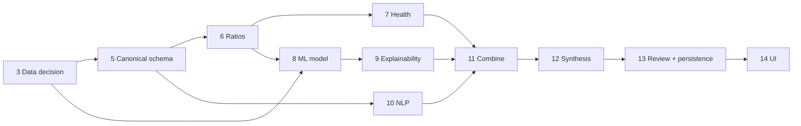

# Roadmap — AI Credit Risk Monitor Copilot

| | |
|---|---|
| **Status** | Phase 6 complete — deterministic ratio engine delivered; Phase 7 next |
| **Date** | 2026-09-16 |

Phases are completed one at a time. Each phase ends with tests/checks, a
status report and an explicit go-ahead before the next phase starts.

## Phase status

| # | Phase | Status | Amendment ([D-009](decision_log.md)) |
|---|---|---|---|
| 1 | Problem definition & product design | ✅ Complete | Added data feasibility research and decision log |
| 2 | Engineering environment & repository | ✅ Complete | Confirmed Python 3.12 library compatibility ([engineering_setup.md](engineering_setup.md)); initial UI framework accepted ([D-012](decision_log.md)) |
| 3 | Data acquisition & understanding | ✅ Complete | Dataset decision gate resolved: Candidate B primary, audited at full scale — 178 usable positive events, ~7,973-company candidate negative universe ([D-013](decision_log.md), [data_dictionary.md](data_dictionary.md)). Point-in-time feature extraction and the actual negative-class sample are Phase 5/8 work |
| 4 | Document extraction | ✅ Complete | Golden set built: 12 filings, 342 XBRL reference values ([golden_set.md](golden_set.md)). **HTML path recovers 85% of reference values (100% on 2025–26 filings)** — first evidence the primary path works. HTML is primary and golden-set PDFs are generated, since SEC publishes no PDFs ([D-014](decision_log.md)); R-19 closed by measurement — the two PDF libraries tied 179/179, so pdfplumber is chosen on speed ([D-015](decision_log.md)). Also delivered: item-section detection for Phase 10 and upload validation for FR-04 ([extraction.md](extraction.md)). **Raised R-11 to High:** concept coverage is far thinner than assumed ([data_dictionary.md §6.1](data_dictionary.md)) |
| 5 | Financial statement parsing | ✅ Complete (audited) | Typed canonical schema with provenance ([canonical_schema.md](canonical_schema.md)): 26 concepts, per-concept XBRL tag policies and derivation rules ([D-016](decision_log.md), [D-018](decision_log.md)), annual-period and unit filtering, accounting-consistency validation, and bounded HTML corroboration ([D-017](decision_log.md)). **QM-01: 97.2% value/period accuracy** (247/254; the 7 misses are a ground-truth definition difference, 0 wrong values), 88.8% mean concept completeness, 12/12 independent balance-sheet checks. The audit found and fixed circular validation, liabilities overstated by noncontrolling interest, and debt understated by reading components as alternatives. Table-to-period alignment for FR-04 uploads deferred |
| 6 | Deterministic ratio engine | ✅ Complete (audited) | 13-ratio catalog across liquidity/leverage/profitability/coverage/cash-flow ([ratios.md](ratios.md)); 4-state result model ([D-019](decision_log.md)); ending-balance ROA/ROE ([D-020](decision_log.md)). QM-02: 11/13 ratios reach 92-100% primary-period coverage on the golden set; full multi-year coverage falls to 48.2% on comparative years, a Phase 5 tag-completeness gap on older columns, not a Phase 6 defect ([ratios.md §6](ratios.md)). **Audit** found no formula/accounting/circularity errors; verified real-corpus invariants and the near-zero-denominator warning against distressed filers; added structured warnings and machine-readable missing/conflicting-concept accessors ([D-021](decision_log.md), [ratios.md §8](ratios.md)) |
| 7 | Financial health analysis | Not started | Thresholds in configuration; industry-aware hooks |
| 8 | Baseline ML model (logistic regression) | Not started | Out-of-time split; transparent ratio baseline for comparison |
| 9 | ML evaluation & explainability | Not started | — |
| 10 | NLP risk signals | Not started | Hand-labelled sentence set for precision/recall |
| 11 | Combine analytical outputs | Not started | Contradiction test cases; historical replay |
| 12 | Risk synthesis LLM (single grounded call) | Not started | Evidence-ID citations validated by code |
| 13 | Human analyst review | Not started | **Delivered with SQLite persistence** (append-only drafts and reviews) |
| 14 | Dashboard / product UI | Not started | — |
| 15 | Database / SQL architecture | Not started | Becomes schema hardening, versioning and history queries |
| 16 | External API integration | Not started | SEC is already integrated by Phase 5; this phase covers additional providers |
| 17 | Robustness & evaluation | Not started | Consolidates per-phase evaluation suites |
| 18 | Product & UX polish | Not started | — |
| 19 | Documentation & architecture | Not started | Docs are maintained continuously; this phase finalises them |
| 20 | Resume & interview preparation | Not started | Only measured results |

## Dependencies worth noting

