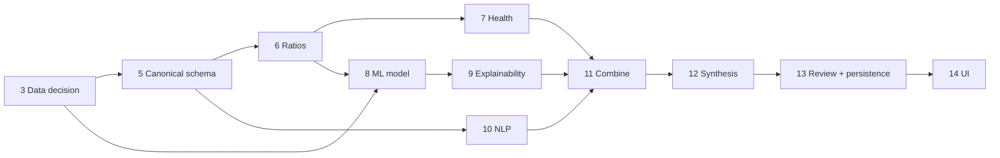

# Roadmap — AI Credit Risk Monitor Copilot

| | |
|---|---|
| **Status** | Phase 2 complete; Phase 3 decision gate resolved ([D-013](decision_log.md)) — dataset construction next |
| **Date** | 2026-09-14 |

Phases are completed one at a time. Each phase ends with tests/checks, a
status report and an explicit go-ahead before the next phase starts.

## Phase status

| # | Phase | Status | Amendment ([D-009](decision_log.md)) |
|---|---|---|---|
| 1 | Problem definition & product design | ✅ Complete | Added data feasibility research and decision log |
| 2 | Engineering environment & repository | ✅ Complete | Confirmed Python 3.12 library compatibility ([engineering_setup.md](engineering_setup.md)); initial UI framework accepted ([D-012](decision_log.md)) |
| 3 | Data acquisition & understanding | 🟡 In progress | Dataset decision gate resolved: Candidate B primary ([D-013](decision_log.md), [data_feasibility.md §6](data_feasibility.md)). Remaining: entity linkage at scale, point-in-time extraction, negative-class population, data dictionary |
| 4 | Document extraction | Not started | Builds a golden evaluation set of 10-K statements with XBRL reference values |
| 5 | Financial statement parsing | Not started | Introduces typed domain models with provenance; XBRL ingestion with point-in-time rule (D-005, D-008) |
| 6 | Deterministic ratio engine | Not started | Ratio definitions shared with ML features |
| 7 | Financial health analysis | Not started | Thresholds in configuration; industry-aware hooks |
| 8 | Baseline ML model (logistic regression) | Not started | Out-of-time split; transparent ratio baseline for comparison |
| 9 | ML evaluation & explainability | Not started | — |
| 10 | NLP risk signals | Not started | Hand-labelled sentence set for precision/recall |
| 11 | Combine analytical outputs | Not started | Contradiction test cases; historical replay |
| 12 | Risk synthesis LLM (single grounded call) | Not started | Evidence-ID citations validated by code |
| 13 | Human analyst review | Not started | **Delivered with SQLite persistence** (append-only drafts and reviews) |
| 14 | Dashboard / product UI | Not started | — |
| 15 | Database / SQL architecture | Not started | Becomes schema hardening, versioning and history queries |
| 16 | External API integration | Not started | SEC is already integrated by Phase 5; this phase covers additional providers |
| 17 | Robustness & evaluation | Not started | Consolidates per-phase evaluation suites |
| 18 | Product & UX polish | Not started | — |
| 19 | Documentation & architecture | Not started | Docs are maintained continuously; this phase finalises them |
| 20 | Resume & interview preparation | Not started | Only measured results |

## Dependencies worth noting

