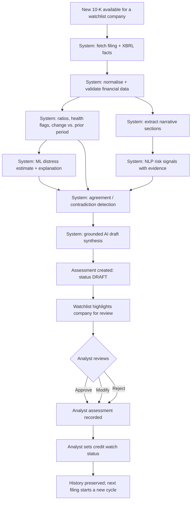
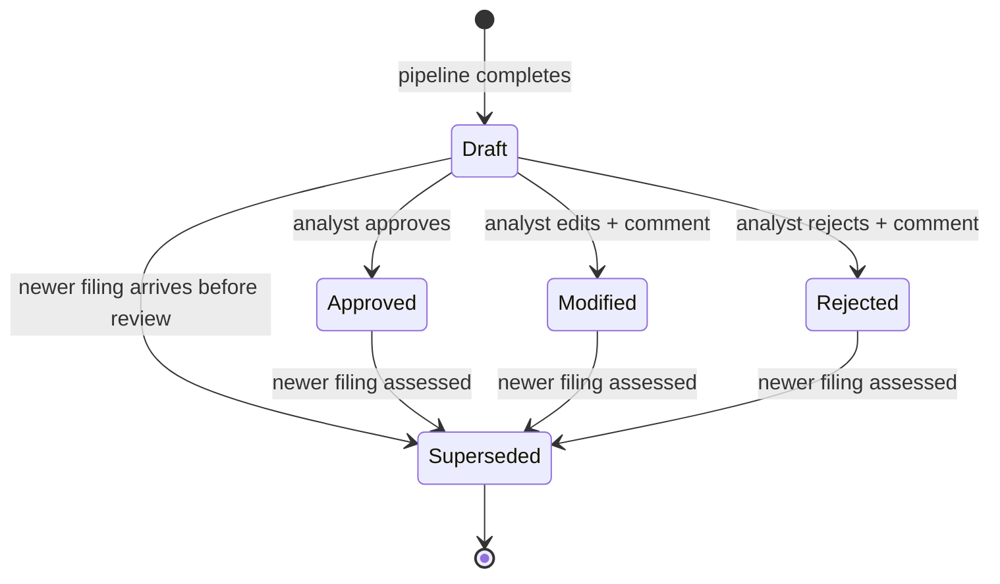

# User Workflow — AI Credit Risk Monitor Copilot

| | |
|---|---|
| **Status** | Draft v0.1 — Phase 1 |
| **Date** | 2026-09-13 |
| **Related** | [product_requirements.md](product_requirements.md) · [scope.md](scope.md) |

---

## 1. Personas in the workflow

| Persona | Role in the workflow |
|---|---|
| **Analyst** (primary) | Maintains the watchlist, reviews drafts, records the final assessment and credit watch status |
| **Risk / portfolio manager** | Reads analyst-reviewed assessments and the watchlist; does not review drafts |
| **Validator / auditor** | Inspects versions, provenance and review history after the fact |
| **System** | Fetches data, runs the analytical pipeline, prepares drafts — never decides |

## 2. Current-state workflow (assumed)

Based on publicly described credit-monitoring practice; not validated with
practising analysts (see [A-01](assumptions.md)).

1. Track filing calendars for each borrower; notice when a 10-K or 10-Q is out.
2. Download the filing; locate the financial statements.
3. Re-key key line items into a spreadsheet ("spreading").
4. Recompute ratios; compare to prior periods and, where relevant, covenant levels.
5. Read MD&A and risk factors for new or intensifying concerns.
6. Form a view; write a review memo.
7. Update the internal watch status; escalate if needed.

**Where it breaks:** steps 2–4 consume most of the time and introduce errors;
step 5 is the first to be shortened under time pressure; steps 6–7 record
conclusions but rarely the exact evidence behind them.

## 3. Future-state monitoring cycle

Who does what:

| Step | Actor | Automatic? |
|---|---|---|
| Detect new filing / fetch data | System | Yes (or analyst-triggered in MVP) |
| Extraction, normalisation, validation | System | Yes |
| Ratios, flags, changes | System | Yes |
| ML estimate, NLP signals, contradictions | System | Yes |
| Draft synthesis | System | Yes |
| Triage the watchlist | Analyst | No |
| Review draft: approve / modify / reject | Analyst | **No — required** |
| Set credit watch status | Analyst | **No — required** |
| Escalate / act on the credit | Analyst & organisation | **Outside the product** |

## 4. Company review journey

The company view is organised around the five questions an analyst asks, in
order, using progressive disclosure (summary first, detail on demand):

| # | Analyst question | What the view shows first | Drill-down |
|---|---|---|---|
| 1 | **What is the risk, and did it change?** | Draft risk level, health flags with trend arrows, what changed since last period, ML estimate with its applicability warnings | Full ratio table, multi-year trends |
| 2 | **Why?** | Top reasons behind each flag; top model drivers | Ratio formulas and inputs; local explanation detail |
| 3 | **What evidence supports it?** | Evidence list with source references | Source value / quote in context (filing, section, page) |
| 4 | **What conflicts with it?** | Contradictions and uncertainties, displayed **next to** the review controls | The conflicting evidence items side by side |
| 5 | **What should I check?** | Recommended analyst checks, data gaps, validation failures | Missing fields and failed sanity checks |

Then: **review decision** (§6).

## 5. Human-in-the-loop boundary

| Capability | System may do automatically | Requires analyst action | Never done by the system |
|---|---|---|---|
| Fetch/extract/normalise data | ✅ | | |
| Correct an extracted value | | ✅ (recorded as an override with reason; original kept) | |
| Compute ratios, flags, changes | ✅ | | |
| Produce ML estimate and explanation | ✅ | | |
| Produce draft synthesis and draft risk level | ✅ | | |
| Approve / modify / reject the draft | | ✅ | |
| Set credit watch status | | ✅ | |
| Mark an assessment final | | ✅ | |
| Recommend or execute lending actions (limits, pricing, covenants, exit) | | | ❌ |
| Edit or delete a recorded analyst review | | | ❌ (corrections are new review records) |

**Terminology is deliberately distinct:**
- *Draft risk level* — produced by the AI synthesis; always labelled "AI draft".
- *Credit watch status* — set only by the analyst (`stable` · `monitor` · `watchlist` · `escalate` — **confirmed in Phase 13** ([D-049](decision_log.md)): each term names what the analyst will do next, not how bad the company is).

## 6. Assessment lifecycle

| Action | Meaning | Required | Stored |
|---|---|---|---|
| **Approve** | Analyst accepts the draft as an accurate basis for their assessment | Credit watch status | Draft (unchanged) + review record |
| **Modify** | Draft is partly right; analyst corrects conclusions, risks or risk level | Comment + credit watch status | Draft (unchanged) + analyst's modified assessment + review record |
| **Reject** | Draft is wrong or unusable | Comment (reason) + credit watch status, or "needs re-run" | Draft (unchanged) + review record |

Rules:
- A review always references the exact assessment version (and therefore the model, prompt and data versions) it reviewed.
- A superseded assessment keeps its review; it simply is no longer the latest.
- Pipeline failures produce a Draft with `insufficient_data` sections and stated reasons — never a silently missing assessment.

## 7. Designing against automation bias

A fluent AI draft invites rubber-stamping. The workflow counters this with:

1. **No default review action** — nothing is pre-selected.
2. **Contradictions and uncertainties are shown adjacent to the review buttons**, not buried below them.
3. **Reject is as easy as approve**; neither is visually privileged.
4. **Every AI section is labelled as a draft**, with the model/prompt version visible.
5. **Data gaps and validation failures are surfaced before the synthesis**, so the analyst sees what the draft could not know.

## 8. Workflow edge cases

| Situation | Expected behaviour |
|---|---|
| Company has < 3 fiscal years of data | Trend-based flags return `insufficient_data`; point-in-time flags still computed |
| Filing restated a prior year | New assessment uses as-filed values for its as-of date; restatement noted as an analyst check |
| XBRL and uploaded PDF disagree | Discrepancy listed as a validation finding; neither value silently wins |
| New filing arrives while a draft is under review | Existing draft becomes Superseded only after the new assessment is created; analyst is told |
| Company out of scope (e.g. a bank) | Rejected at watchlist entry with the reason |
| Model inputs missing or out of training range | ML section shows applicability warning; estimate may be withheld |
| LLM call fails or fails grounding validation | Deterministic sections remain; synthesis section shows `insufficient_data` with reason |
| Late filing / missed filing deadline | Out of MVP scope; candidate monitoring signal for later phases |
| Company delisted, acquired or files for bankruptcy | Out of MVP scope for automated handling; analyst can remove it from the watchlist |
